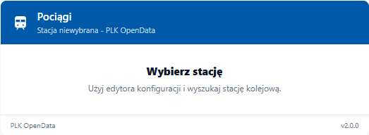
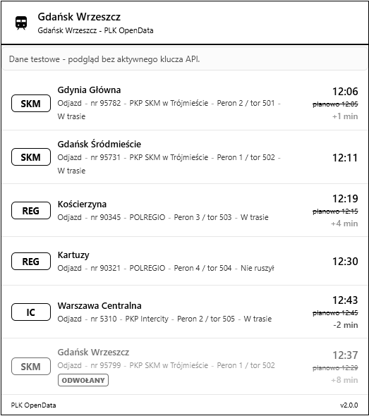
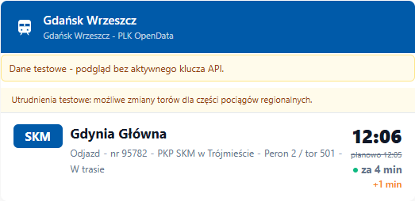
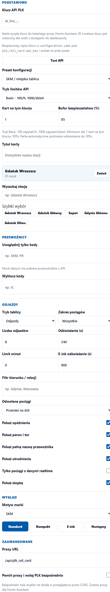

# PLK Rail Card

[](https://hacs.xyz)
[](#)

Work in progress Home Assistant integration with a bundled Lovelace card for railway departures from the PLK OpenData API.

## Status

This project is **work in progress**. The repository structure, card UI and local mock preview are prepared, but the status of end-to-end operation with Home Assistant and the real PLK API is **not confirmed yet**.

Do not treat this as production-ready. Expect API mapping fixes, Home Assistant packaging fixes and UI changes before a stable release.

## What It Is

This repository is intended to be installed as a **Home Assistant integration** through HACS, not as a standalone dashboard plugin. The integration contains both parts:

- Python backend in `custom_components/plk_rail_card`
- bundled Lovelace card in `custom_components/plk_rail_card/www/plk-rail-card.js`

The backend stores the optional PLK API key, exposes an authenticated proxy at `/api/plk_rail_card`, serves the card JavaScript at `/plk_rail_card/plk-rail-card.js`, and tries to register the frontend module automatically.

## Screenshots

### Standard



### E-ink



### Next train



### Visual editor



## Installation

### HACS Custom Repository

Add this repository to HACS as a custom repository with category **Integration**. After installation, restart Home Assistant.

Then add the integration in Home Assistant:

```text
Settings -> Devices & services -> Add integration -> PLK Rail Card
```

You can paste the PLK API key in the integration dialog, or leave it empty and put the key directly in the card config for quick testing.

Alternative YAML setup:

```yaml
plk_rail_card:
  api_key: YOUR_PLK_API_KEY
```

After adding the integration, verify that this URL loads JavaScript instead of 404:

```text
/plk_rail_card/plk-rail-card.js
```

The card should be available in Lovelace after the integration is added and Home Assistant is restarted. If it is not, use the manual resource fallback below.

### Manual

Copy `custom_components/plk_rail_card` to:

```text
config/custom_components/plk_rail_card
```

Then follow the same integration and Lovelace resource steps above.

## Configuration

Minimal, with the key stored in Home Assistant:

```yaml
type: custom:plk-rail-card
proxy_url: /api/plk_rail_card
station_id: "38851"
station_name: Gdańsk Wrzeszcz
api_limit_mode: basic
```

Quick SKM-style preset:

```yaml
type: custom:plk-rail-card
proxy_url: /api/plk_rail_card
station_id: "38851"
station_name: Gdańsk Wrzeszcz
preset: skm_city
```

Full example:

```yaml
type: custom:plk-rail-card
proxy_url: /api/plk_rail_card
station_id: "38851"
station_name: Gdańsk Wrzeszcz
title: Pociągi z Wrzeszcza
preset: skm_city
display_preset: standard
brand_preset: skm
board_mode: departures
train_scope: all
cancelled_mode: bottom
max_departures: 8
refresh_interval: 240
e_ink_refresh_interval: 900
api_limit_mode: basic
api_key_clients: 1
api_limit_safety: 85
max_minutes_ahead: 0
show_delays: true
show_platform: true
show_carrier_name: true
show_disruptions: true
show_footer: true
realtime_only: false
carriers_include:
  - SKM
  - PR
carriers_exclude: []
destination_filter:
  - Gdynia
```

## Options

| Option | Type | Default | Description |
|---|---:|---:|---|
| `api_key` | string | empty | Optional PLK API key in Lovelace config. Prefer the integration config. |
| `proxy_url` | string | `/api/plk_rail_card` | Home Assistant proxy endpoint. |
| `direct_api` | boolean | `false` | Calls PLK directly from the browser. Usually fails because of CORS. |
| `preset` | string | `custom` | `custom`, `skm_city`, `long_distance`, `e_ink_station_board`, `next_train`. |
| `api_limit_mode` | string | `basic` | Rate limit profile: `basic`, `standard`, `premium` or `custom`. |
| `api_key_clients` | number | `1` | Number of cards/devices sharing the same API key. |
| `api_limit_safety` | number | `85` | Percentage of the API limit the card may use. |
| `station_id` | string | empty | PLK station ID from the station dictionary. |
| `station_name` | string | empty | Display name saved by the editor. |
| `title` | string | station name | Custom card title. |
| `display_preset` | string | `standard` | `standard`, `compact`, `e_ink` or `next`. |
| `brand_preset` | string | `plk` | `plk`, `skm`, `regio`, `ic` or `neutral`. |
| `board_mode` | string | `departures` | `departures`, `arrivals` or `both`. |
| `train_scope` | string | `all` | `all`, `regional` or `long_distance`. |
| `cancelled_mode` | string | `show` | `show`, `hide` or `bottom`. |
| `max_departures` | number | `8` | Number of rows, 3-30. Next mode forces 1. |
| `refresh_interval` | number | `240` | Refresh in seconds, clamped by API limit settings. |
| `e_ink_refresh_interval` | number | `600` | Refresh in seconds for e-ink mode. |
| `show_delays` | boolean | `true` | Show delay badges and planned time for delayed trains. |
| `show_platform` | boolean | `true` | Show platform and track. |
| `show_carrier_name` | boolean | `false` | Show full carrier name instead of only code. |
| `show_disruptions` | boolean | `false` | Fetch and show disruptions. Adds one API request per refresh. |
| `show_footer` | boolean | `true` | Show footer. E-ink hides volatile refresh time. |
| `realtime_only` | boolean | `false` | Show only trains matched with realtime operations. |
| `carriers_include` | list/string | empty | Carrier codes to include, for example `SKM`, `PR`, `IC`. Empty means all. |
| `carriers_exclude` | list/string | empty | Carrier codes to exclude. |
| `destination_filter` | list/string | empty | Show only rows whose destination or origin contains one of these phrases. |

## Local Testing

Run from this repository:

```bash
node dev/server.cjs 8124
```

Open:

```text
http://127.0.0.1:8124/dev/
```

For live local testing, pass your API key through the local proxy process:

```bash
$env:PLK_API_KEY="YOUR_PLK_API_KEY"
node dev/server.cjs 8124
```

Use **Mock danych** in the local toolbar to preview fake SKM/PKM departures while the PLK key is inactive.

## Troubleshooting

If Home Assistant shows:

```text
Custom element doesn't exist: plk-rail-card
```

check these items:

1. The integration is installed and added in `Settings -> Devices & services`.
2. Home Assistant was restarted after installation.
3. `/plk_rail_card/plk-rail-card.js` opens in the browser and returns JavaScript, not 404.
4. Browser cache was hard-refreshed after installing or updating the integration.
5. If automatic registration fails, add this Lovelace resource manually:

```yaml
url: /plk_rail_card/plk-rail-card.js
type: JavaScript module
```

## Recommended Refresh

The default card performs two data calls per refresh: planned schedules and realtime operations. Enabling disruptions adds a third call.

With `api_limit_mode: basic`, `api_key_clients: 1`, `api_limit_safety: 85` and disruptions enabled, the card will not refresh faster than about 305 seconds even if `refresh_interval` is set lower.
